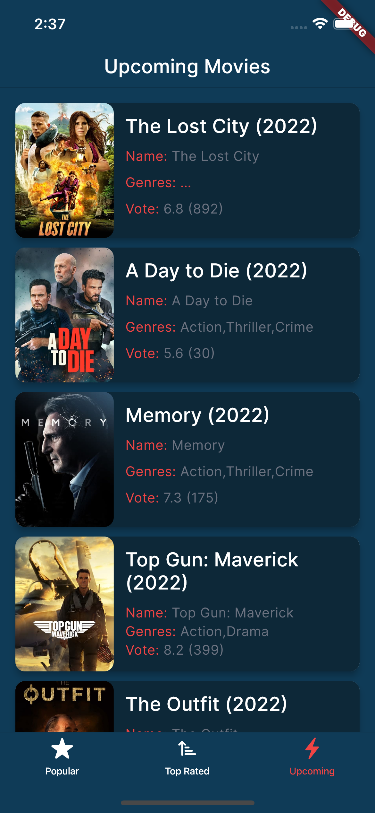

# Welcome to the TMDB test task repository✌🏻
This repository provides information about different kinds of movies. movies are grouped by categories: Top Rated, Popular and Upcoming.

## Quick Start⚡️😎
TMDB uses the Movie DB API to retrieve all movies and data. You don’t need to get an API KEY from The Movie DB to run this app on your computer. It is located as `apiKey` in `lib/utils/constatns.dart`. The app uses the v3 version of The Movie DB.

## 📸 Examples
<pre>
            
</pre>

<pre>
            
</pre>

## Modularization Structure 🔥

    # Root Project
    .
    |
    └──lib                         # Name of module (default from Flutter).
        ├── bloc                   # Business Logic of application. it stores all the states associated with the application and TMDB.
        |    ├── base              # The files in this directory are configured to separate the data coming from TMDB into different state files
        |    ├── casts             # State manager for actors    
        |    └── movies            # State manager for movies
        ├── cells                  # This directory stores all reusable components of the application
        ├── model                  # Models 
        |    └── pagination        # Files in the directory consider data for the pagination 
        ├── repositories           # Repostory 
        |    └── util              # Files in that folder store configurations for utils and exceptions
        ├── screens                # View
        ├── theme                  # Theming app
        └── utils                  # It stores util files of application to configure data 
                   
                   
   

## Build With🛠

[Cupertino Icons][cupertinoIcons] - This is an asset repo containing the default set of icon assets used by Flutter's Cupertino widgets.

[Http][http] - This package contains a set of high-level functions and classes that make it easy to consume HTTP resources. It's multi-platform, and supports mobile, desktop, and the browser.

[Logger][logger] - Small, easy to use and extensible logger which prints beautiful logs

[BLoC][bloc] - Bloc makes it easy to separate presentation from business logic, making our code fast, easy to test, and reusable.

[Readmore][readmore] - A Flutter plugin than allow expand and collapse text.

[cupertinoIcons]:https://pub.dev/packages/cupertino_icons
[http]:https://pub.dev/packages/http
[logger]:https://pub.dev/packages/logger
[bloc]:https://pub.dev/packages/flutter_bloc
[readmore]:https://pub.dev/packages/readmore
